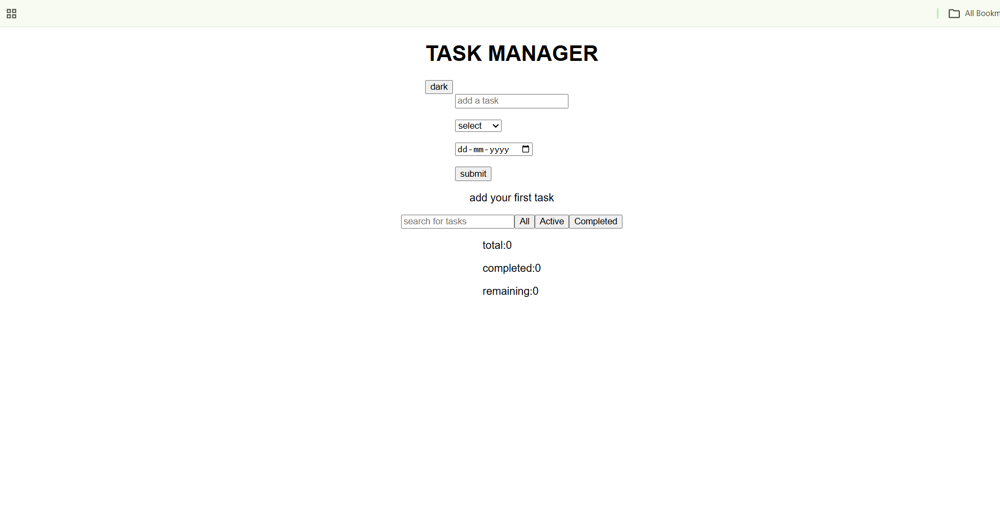

# 📝 Task Manager App

A modern Task Manager application built with **React** that helps users organize and manage their daily tasks efficiently. The application supports task creation, completion tracking, searching, filtering, dark mode, and persistent storage using Local Storage.

## 🚀 Live Demo

🔗 https://abhilashch12.github.io/task-manager-app/

---

## ✨ Features

- ➕ Add new tasks
- ✅ Mark tasks as completed
- 🗑️ Delete tasks
- 🔍 Search tasks by title
- 📂 Filter tasks (All, Active, Completed)
- 🌙 Light/Dark Theme
- 💾 Persistent storage using Local Storage
- 📊 Task Statistics (Total, Completed, Remaining)
- 📱 Responsive Design

---

## 🛠️ Tech Stack

- React
- JavaScript (ES6+)
- Context API
- Custom Hooks
- useLocalStorage
- CSS
- Vite
- Git
- GitHub Pages

---

## 📸 Screenshot



---

## 📦 Installation

Clone the repository

```bash
git clone https://github.com/abhilashch12/task-manager-app.git
```

Go to the project directory

```bash
cd task-manager-app
```

Install dependencies

```bash
npm install
```

Run the development server

```bash
npm run dev
```

Build the project

```bash
npm run build
```

Deploy to GitHub Pages

```bash
npm run deploy
```

---

## 📂 Project Structure

```text
task-manager-app
│
├── public
├── screenshots
│   └── screenshot.png
├── src
│   ├── components
│   ├── context
│   ├── hooks
│   ├── App.jsx
│   └── main.jsx
├── package.json
├── vite.config.js
└── README.md
```

---

## 🎯 What I Learned

- Building reusable React components
- Managing state with Context API
- Creating custom hooks
- Using Local Storage for data persistence
- Form validation
- Search and Filter functionality
- Conditional Rendering
- Git & GitHub workflow
- Deploying React applications using GitHub Pages

---

## 👨‍💻 Author

**Abhilash Reddy**

GitHub: https://github.com/abhilashch12

---

⭐ If you like this project, consider giving it a star on GitHub!